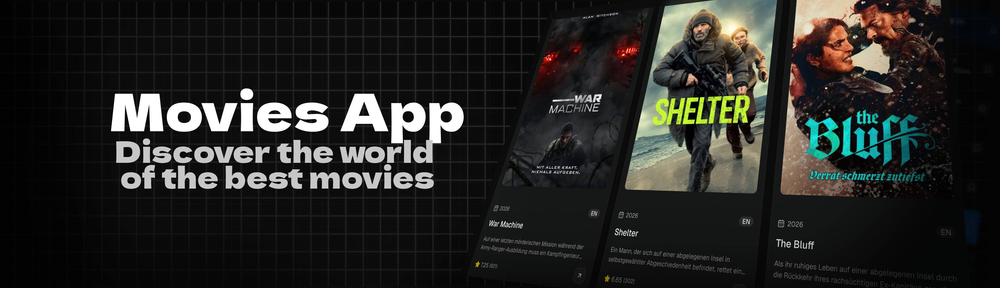

<div align="center">
  <br />
    
  <br />
  <div>
   
    
    
    
    
    
    
    
   </div>
  <h3 align="center">🎬 Movies App</h3>
  <p align="center">
    A movie discovery app built with <strong>Next.js</strong> and <strong>TMDB API</strong>.  
    Supports multiple languages.
  </p>
</div>

---

## 📋 Table of Contents

1. ✨ [Introduction](#introduction)
2. 🧰 [Tech Stack](#tech-stack)
3. ⚡ [Quick Start](#quick-start)
4. 🧪 [Running Tests](#running-tests)
5. ✍️ [Author](#author)

---

## <a name="introduction">✨ Introduction</a>

**Movies App** is a fullstack web application for discovering and exploring movies.  
Built with **Next.js App Router**, it features internationalization (English & German),  
movie listings powered by the **TMDB API**.

---

## <a name="tech-stack">🧰 Tech Stack</a>

- ⚛️ **Next.js 16** — App Router, ISR, SSR
- 🧠 **TypeScript** — Static typing
- 🎨 **Tailwind CSS** — Utility-first styling
- 🗄️ **TanStack Query** — Server state management
- 🐻 **Zustand** — Client state management
- 🧩 **shadcn/ui** — UI components
- 📝 **React Hook Form** — Forms and validation
- 🌍 **next-intl** — Internationalization (EN / DE)
- 🧪 **Playwright** — E2E testing
- 🎬 **TMDB API** — Movie data source
- 🖼️ **shadcnstudio.com** — Ready-made UI blocks

---

## <a name="quick-start">⚡ Quick Start</a>

### 📦 Prerequisites

- [Node.js](https://nodejs.org/) v18+
- TMDB API key → [https://www.themoviedb.org/](https://www.themoviedb.org/)

### 🚀 Run Locally

1. **Clone the repository:**

```bash
git clone https://github.com/andreytr449/next.js
cd next.js
```

2. **Install dependencies:**

```bash
npm install
```

3. **Set up environment variables:**

```env
TMDB_API_KEY=your_api_key_here
```

4. **Start the development server:**

```bash
npm run dev
```

Open [http://localhost:3000/en/items](http://localhost:3000/en/items)

---

## <a name="running-tests">🧪 Running Tests</a>

```bash
# Run all E2E tests
npx playwright test

# Run with UI
npx playwright test --ui

# Run with browser visible
npx playwright test --headed
```

---

## <a name="author">✍️ Author</a>

💼 GitHub: [https://github.com/andreytr449](https://github.com/andreytr449)
